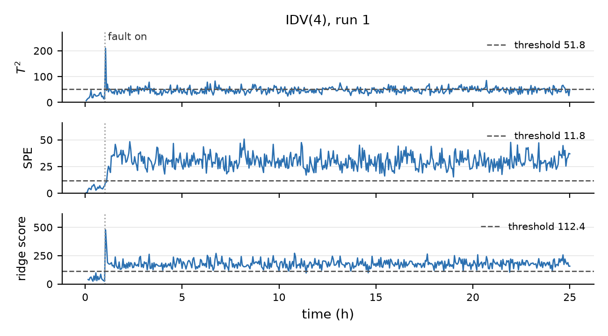

## The plant and the task

The Tennessee Eastman process (TEP) is a simulated chemical plant published by Eastman Chemical Company as a benchmark for process control and monitoring (Downs and Vogel, 1993). Gaseous reactants A, C, D and E and an inert B are fed to a reactor, where they form the liquid products G and H and a by-product F. The reactor effluent is cooled in a condenser and split in a vapour-liquid separator. The vapour returns to the reactor through a compressor, with part of it purged, and the liquid goes to a stripper that removes the remaining reactants. A plant-wide control system holds the plant at its operating point. The data have 52 channels sampled every 3 minutes: 41 measurements of flows, temperatures, pressures, levels and compositions (xmeas_1 to xmeas_41) and 11 manipulated variables, the controller outputs to the valves (xmv_1 to xmv_11).

Faults are rare and a new fault is often of a type not recorded before, so a classifier trained on past faults is of limited use. We build two detectors that learn only what normal operation looks like and raise an alarm when the plant departs from it. Both are trained on 300 fault-free runs of 25 h (500 samples). Their thresholds are set on 100 further fault-free runs, and their false-alarm rates are measured on another 100. We test them on 20 runs of each of the 20 programmed faults (IDV 1 to 20), which start after sample 20 (Rieth et al., 2017), and report the share of each faulty period in alarm, the time to the first alarm, and the channels that drive the alarm.

## The two detectors

Each channel is standardised with its mean and standard deviation (ddof = 1) over training runs 1 to 300. The threshold of each statistic is the 99th percentile of its values on validation runs 301 to 400. A sample is in alarm when it and the two samples before it in the same run all exceed the threshold.

PCA monitor. PCA finds the orthogonal directions of largest variance in the standardised training data, the eigenvectors of its correlation matrix. We keep the smallest number of components whose eigenvalues sum to at least 90 % of the total: k = 31 (90.2 %; 30 components give 88.9 %). For a standardised sample $z$, with $P$ the retained loading vectors and $\lambda_i$ their eigenvalues, $t = P^\top z$, $T^2 = \sum_{i=1}^{k} t_i^2/\lambda_i$ and $\mathrm{SPE} = \lVert z - PP^\top z \rVert^2$. $T^2$ is the distance from the centre within the retained subspace, with each direction scaled by its variance. SPE is the squared size of the part of the sample that the 31 directions cannot reproduce, so it increases when the usual correlations between channels no longer hold. The thresholds are 51.8 for $T^2$ and 11.8 for SPE.

Forecast monitor. A single Ridge(alpha=1.0), fitted on the 149,400 training rows, predicts all 52 standardised channels at sample $t$ from the 104 values at $t-1$ and $t-2$ in the same run. Each residual is divided by that channel's residual standard deviation on the training runs, and the score is the sum of the 52 squared scaled residuals. On normal data each term has mean one, so the score is close to 52 (52.1 on the validation runs); the threshold is 112.4. The score is large when a channel differs from what the two previous samples predict. For autocorrelated channels the residual standard deviation is a small fraction of the channel's own (0.044 for the stripper temperature xmeas_18), so a change that is small on the channel's scale can still give a large term.

{width=68%}

Figure 1 shows IDV 4, a step in the reactor cooling water inlet temperature. $T^2$ jumps to 209 at sample 21 and then varies around its threshold (median 47, 32 % of faulty samples above), so three exceedances in a row are rare. SPE is above its threshold from sample 23 for 99.6 % of the faulty samples. The ridge score peaks at 98.2 before the fault, reaches 477 at sample 21 and is above its threshold for 99.2 % of the faulty samples.

\newpage

## Results

| IDV | fault (Chiang et al., 2000) | rate T² | rate SPE | rate ridge | delay T² | delay SPE | delay ridge |
|---:|:-----------------------------------|------:|------:|------:|-------:|-------:|-------:|
| 0 | none: false-alarm rate, test runs | 0.05 | 0.00 | 0.00 | | | |
| 1 | A/C feed ratio, step | 98.5 | 99.2 | 99.4 | 25.5 | 15 | 12 |
| 2 | B composition, step | 97.3 | 95.9 | 96.5 | 39 | 57 | 51 |
| 3 | D feed temperature, step | 0.0 | 0.0 | 0.0 | 231 (19) | – (20) | – (20) |
| 4 | reactor cooling water inlet temp., step | 9.1 | 99.4 | 96.9 | 64.5 | 12 | 9 |
| 5 | condenser cooling water inlet temp., step | 33.2 | 12.5 | 99.6 | 9 | 15 | 9 |
| 6 | A feed loss, step | 97.9 | 99.6 | 99.6 | 33 | 9 | 9 |
| 7 | C header pressure loss, step | 99.6 | 99.6 | 99.6 | 9 | 9 | 9 |
| 8 | A, B, C feed composition, random | 94.2 | 82.2 | 95.4 | 70.5 | 67.5 | 52.5 |
| 9 | D feed temperature, random | 0.0 | 0.0 | 0.0 | 231 (19) | – (20) | – (20) |
| 10 | C feed temperature, random | 8.5 | 17.7 | 69.8 | 471 | 177 | 67.5 |
| 11 | reactor cooling water inlet temp., random | 25.8 | 43.4 | 45.4 | 43.5 | 40.5 | 33 |
| 12 | condenser cooling water inlet temp., random | 94.4 | 86.7 | 95.7 | 37.5 | 48 | 30 |
| 13 | reaction kinetics, slow drift | 88.4 | 89.3 | 90.2 | 159 | 136.5 | 138 |
| 14 | reactor cooling water valve, sticking | 97.8 | 78.4 | 99.5 | 12 | 13.5 | 9 |
| 15 | condenser cooling water valve, sticking | 0.0 | 0.0 | 0.0 | 231 (19) | – (20) | – (20) |
| 16 | unknown | 1.9 | 10.1 | 71.2 | 690 (3) | 156 | 45 |
| 17 | unknown | 66.6 | 86.8 | 86.7 | 138 | 118.5 | 118.5 |
| 18 | unknown | 87.1 | 88.4 | 89.3 | 175.5 | 151.5 | 141 |
| 19 | unknown | 1.0 | 0.3 | 2.9 | 471 | 610.5 (6) | 121.5 |
| 20 | unknown | 13.6 | 43.2 | 63.5 | 186 | 165 | 151.5 |

Table 1: detection rate (% of samples after sample 20 in alarm, mean over 20 runs) and median delay (minutes from sample 20 to the first alarm, over the runs that alarmed; runs that never alarmed in brackets). Row 0 is the % of test-run samples in alarm.

About 1 % of single test samples exceed each threshold (1.09, 1.01 and 1.00 %), and after the three-in-a-row rule the false-alarm rates are 0.05 % for $T^2$ and zero for SPE and the ridge. Over the 17 faults that at least one statistic detects, the mean detection rate is 59.7 % for $T^2$, 66.6 % for SPE and 82.4 % for the ridge. The ridge has the highest rate, to within 0.1 points, on 15 of the 17 (all but IDV 2 and 4), and the shortest or equal shortest median delay on 15 of the 17 (all but IDV 2 and 13).

## Comparison

IDV 5: compensated by the controllers. After the step in the condenser cooling water inlet temperature, the controllers return most channels to normal. $T^2$ is in alarm for 94 % of samples 21 to 100, 81 % of samples 101 to 200 and 1 % after that; SPE for 49, 20 and 0 %. Russell et al. (2000) report the same return below the threshold for PCA-based statistics on this fault. The ridge stays in alarm for 97 to 100 % throughout. The change that persists is a 1.9 standard deviation rise in the condenser cooling water flow xmv_11. In training, xmv_11 and the stripper underflow xmeas_17 have correlation $-0.999$, and the ridge prediction of the A feed xmeas_1 gives both channels weights of about 3.2 (lag 2) and 2.5 (lag 1). On normal data the two terms cancel. When only xmv_11 moves they no longer cancel, and the prediction of the A feed is off by about 82 residual standard deviations although the A feed itself is normal. In PCA the same change lies in the residual space, where the mean shift of IDV 5 adds only 1.75 to SPE against a threshold of 11.8.

IDV 10, 16 and 20: faster variation. These faults increase the sample-to-sample variation of a few channels with little change in mean. In IDV 16 the 3-minute changes in the stripper temperature xmeas_18 and steam flow xmeas_19 have 2.5 times their normal standard deviation. The ridge residual standard deviations of these channels are 0.044 and 0.12 of their own, so these changes give large ridge terms (71 % detection). $T^2$ and SPE use only the current sample, and a channel that moves faster but stays in its normal range rarely exceeds their thresholds (1.9 and 10.1 %).

IDV 4: a broken correlation. SPE (99.4 %) and the ridge (96.9 %) detect it and $T^2$ does not (9.1 %). The reactor cooling water flow xmv_10 rises by 7 standard deviations while the reactor temperature xmeas_9, correlated with it at 0.63 in training, stays normal. Only 47 % of the squared mean shift lies in the 31 retained directions. The mean shift has $T^2 = 18.6$, below its threshold, and SPE $= 25.5$, above it. Russell et al. (2000) use this fault as their example of residual-space statistics being more sensitive than $T^2$.

IDV 2: where $T^2$ does best. The B composition step moves many channels along the normal correlation structure (99 % of the squared mean shift lies in the retained subspace), and $T^2$ has the highest rate (97.3 %) and shortest delay (39 min).

## Faults nobody catches

All three statistics miss IDV 3, 9 and 15. SPE and the ridge never alarm after sample 20 in any of the 60 runs. $T^2$ is in alarm for one or two samples in a single run of each fault, which is consistent with its false-alarm rate. Over samples 21 to 500 of these runs, no channel mean differs from the test runs by more than 0.24 standard deviations, and no channel standard deviation changes by more than 14 %. IDV 3 and 9 change the D feed temperature, which is not one of the 52 channels, and none of the recorded channels responds to the sticking condenser cooling water valve of IDV 15. Russell et al. (2000) found the same: several of their PCA, dynamic PCA and CVA statistics flag these three faults at about the rate of normal data, plots of the observations show no change in mean or variance, and they left the three faults out of their comparison. These faults do not change the 52 channels at 3-minute sampling, so a better model of the same channels would not detect them. That would need other measurements, such as the D feed temperature.

## Diagnosis

SPE and the ridge score are sums of squares over the channels, so each splits into per-channel contributions: $(z_j-(PP^\top z)_j)^2$ for SPE and the squared scaled residual for the ridge. For each fault and detector we average them over all samples in alarm after sample 20, pooled over the 20 runs (Figure 2).

{width=66%}

IDV 4, reactor cooling water inlet temperature, step. Both detectors identify the reactor cooling loop. The controller holds the reactor temperature by increasing the cooling water flow: over the alarm samples xmv_10 is 7.0 standard deviations above its training mean (training maximum 5.2), while xmeas_9 stays normal (mean $-0.02$). The ridge assigns 68 % of its score to xmv_10. SPE splits it between xmv_10 (44 %) and xmeas_9 (38 %). The two channels are correlated in training, so the PCA reconstruction raises xmeas_9 together with xmv_10 and part of the residual appears on xmeas_9, which is behaving normally. Westerhuis et al. (2000) call this effect smearing.

IDV 6, A feed loss, step. Before the shutdown, both detectors identify the source: the A feed valve xmv_3 opens fully (median 100 %, against 25 % normally) while the A feed xmeas_1 drops to zero. In every run the reactor pressure reaches the simulator's 3,000 kPa shutdown limit 5.7 to 6.05 h after onset. After that, measurements xmeas_1 to xmeas_22 stay constant while the controllers drive their valves to a limit. These samples are 76 % of the SPE alarm samples, so SPE's overall top channel, the compressor recycle valve xmv_5 (38 %), reflects valves at their limits in a stopped simulation. The ridge keeps the A feed on top. IDV 18 shuts down the same way in 15 of 20 runs.

IDV 10, C feed temperature, random variation. The stream 4 temperature is not recorded. Stream 4 enters the stripper, and both detectors identify the stripper temperature xmeas_18 (29 % of SPE, 71 % of the ridge score). Its standard deviation is 2.7 times normal with no shift in mean, and its 3-minute changes are twice as large, so the ridge alarms on 6,697 samples and SPE on 1,695.

Across the 17 detected faults, the two detectors agree on the top channel for 6. The ridge ranks the A feed xmeas_1 first, with xmv_3 second, for seven faults (1, 5, 6, 8, 12, 13, 18), although only IDV 6 is an A feed fault. In IDV 5 this comes from the xmv_11 and xmeas_17 weights described under Comparison.

## Limits

- All runs come from one simulator, one control structure and one operating point. A real plant changes throughput, grade and equipment condition, and its data include sensor drift, missing values and maintenance periods, so these thresholds and false-alarm rates do not transfer.
- Each run contains one of 20 programmed faults with a known onset and lasts 25 h. Overlapping, unlisted or slower faults are not tested, and 20 runs per fault give only approximate rates.
- Contributions show where a fault is visible, not where it started (IDV 4, 5, 6). Both detectors are linear and use fixed thresholds.

## AI use

We used generative AI to help write the code, and to draft the report. All detection numbers come from the files in results.

\newpage

## Appendix: contributions

- Pingfan bu (Andrew ID: pbu): forecast monitor.

