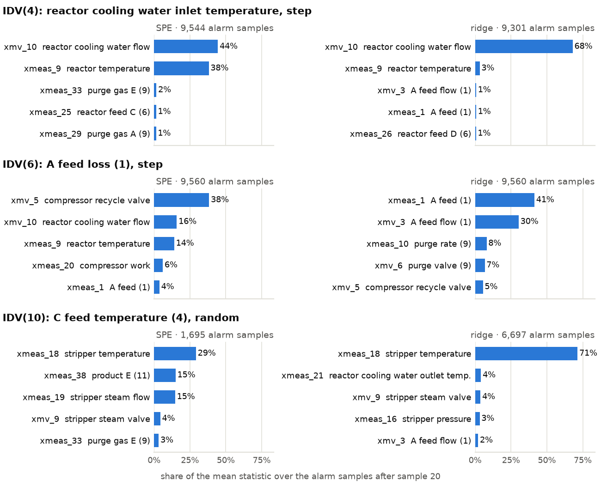

## Diagnosis

SPE and the ridge score are sums of squares over the 52 channels, so each splits into one contribution per channel: $(z_j-(PP^\top z)_j)^2$ for SPE and the squared standardized forecast residual for the ridge. For each fault and detector, `diagnosis.py` averages the contributions over every sample in alarm after sample 20, pooled over the 20 runs, and writes the top five channels to `results/contributions.csv`. The alarms are the evaluation's: `evaluate.py`'s threshold (the 99th percentile of the validation scores) and its three-in-a-row rule, applied to the scores in `results/`. The samples averaged are therefore exactly those counted in `detection.csv`. The per-channel terms come from the PCA and forecast monitors and add up to those scores to a relative 2.3e-13. Faults 3, 9 and 15 never alarm after sample 20 on either detector, so they have no contributions. The other 17 faults give 34 fault–detector pairs.

Figure: the five channels with the largest mean contribution, as a share of the mean statistic over the alarm samples. Stream numbers are in brackets. For IDV(6), most alarm samples come after the simulated plant has shut down (see text).

**IDV(4), reactor cooling water inlet temperature, step.** Both detectors point at the reactor cooling loop, as the description says. In the simulation's control scheme, the reactor temperature is held through a cascade that ends at the reactor cooling water flow, so warmer cooling water is answered with more of it. Over the alarm samples, the cooling water flow xmv_10 sits 7.0 standard deviations above its training mean (training maximum 5.2), while the reactor temperature xmeas_9 stays at its normal value (mean −0.02). The ridge puts 68 % of its score on xmv_10. SPE splits it between xmv_10 (44 %) and xmeas_9 (38 %). The two channels are correlated in training (0.63), so the PCA reconstruction lifts xmeas_9 by 3.4 along with xmv_10, and the residual lands on a channel that is behaving normally. This is the smearing described by Westerhuis et al. (2000).

**IDV(6), A feed loss (stream 1), step.** While the plant runs, both detectors point at the source. The A feed valve xmv_3 opens fully (median 100 %, against 25 % normally), yet the A feed xmeas_1 drops to zero. Before the shutdown described next, these two channels carry 58 % and 38 % of the ridge score and 29 % and 19 % of SPE. In every run, though, the reactor pressure reaches the simulator's 3,000 kPa shutdown limit 5.7 to 6.05 h after the onset. From then on, the 22 continuous measurements stay exactly constant, while the controllers keep integrating and wind their valves up to a limit. The compressor recycle valve xmv_5, for example, ends fully closed in 13 runs and fully open in 7. These frozen samples are 76 % of the alarm samples and carry 97.5 % of the summed SPE, so they dominate the pooled average. SPE's overall top channel, xmv_5 (38 %), is controller windup in a stopped simulation, not the fault spreading through the plant. The ridge keeps the A feed on top (41 % and 30 %). IDV(18) shuts down the same way in 15 of its 20 runs, and its SPE top channel, xmv_5, has the same origin.

**IDV(10), C feed temperature (stream 4), random variation.** No temperature of stream 4 is among the 52 channels. Both detectors point at the stripper temperature xmeas_18 (29 % of SPE, 71 % of the ridge score). Stream 4 enters the stripper, so that is where its temperature first shows up, and the stripper temperature controller answers through the steam flow. SPE next ranks the product E analysis xmeas_38 and the stripper steam flow xmeas_19 (15 % each). For the ridge, no other channel carries more than about 4 %. The stripper temperature swings 2.7 times wider than normal with no shift in its mean, and its 3-minute changes are twice as large. The ridge sees each change as a forecast error and alarms on 6,697 samples. SPE alarms on 1,695 and T² on 815. Both PCA statistics judge each sample on its own, and a stripper temperature that is more variable but otherwise ordinary seldom crosses their thresholds.

**Across all faults.** The two detectors agree on the top channel for 6 of the 17 faults (4, 10, 11, 14, 17, 19). The ridge's top channel is the A feed xmeas_1 for seven faults (1, 5, 6, 8, 12, 13, 18). For six of them, its valve xmv_3 is within 0.6 % of it: the flow follows its valve within one sample, so the two residuals record the same event. Only IDV(6) is a fault in the A feed (stream 1); IDV(18) is undisclosed. In the others, the control system moves the A feed to hold the A content of the reactor feed, so the pair records the response, not the cause. A contribution plot shows where a fault is visible. In a controlled plant, that is often a loop compensating for the fault rather than its origin. In a simulation, it can also be a valve wound up after a shutdown.
