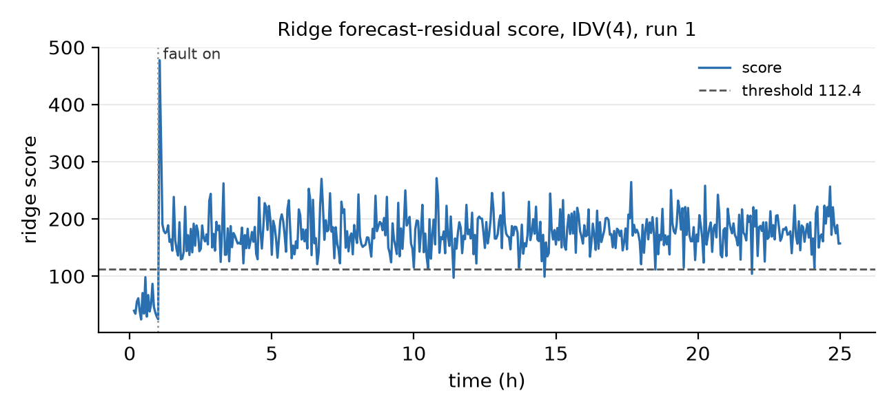

## The two detectors: forecast monitor

The forecast monitor predicts all 52 channels one sample ahead and scores how far the measured values are from the prediction. All channels are standardized with the mean and standard deviation (ddof=1) of fault-free runs 1 to 300. Within each run, the standardized row at t is the target (52 columns) and the standardized rows at t-1 and t-2 are the features (104 columns), so the first two samples of a run have no score. One `Ridge(alpha=1.0)` is fitted on the 149,400 training rows and predicts all 52 channels at once. Each channel's residual is divided by that channel's residual standard deviation on the training runs (ddof=1), and the score is the sum of the 52 squared standardized residuals.

Each squared term has mean one on the training runs, so a normal sample scores about 52. The mean score is 52.1 on the validation runs and 52.2 on the test runs. The threshold, the 99th percentile of the scores on validation runs 301 to 400, is 112.4. The score is large when a channel's value at t is far from what the coefficients learned on normal runs predict from the two previous rows.

Figure: ridge score for IDV(4), a step in the reactor cooling water inlet temperature, run 1. Before the fault the score stays below the threshold (maximum 98.2, at sample 11). It jumps to 477 at sample 21, when the fault starts, and stays between 97 and 271 from sample 23 to the end of the run. Over samples 23 to 500, xmv_10 (reactor cooling water flow) contributes 121 of the mean score of 177. Its standardized value settles near 6.9, higher than any training sample (maximum 5.2), and its residual stays large.
